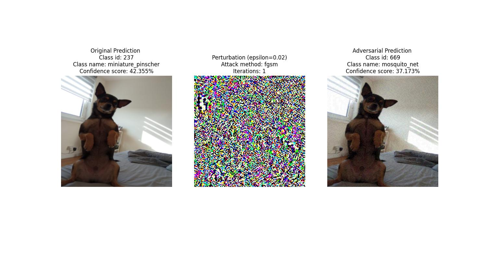
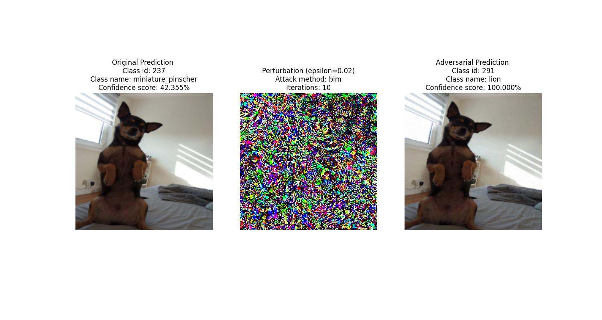

# Targeted Adversarial Examples

An adversarial example is an instance with small, intentional feature perturbations that cause a machine-learning model to make a false prediction. 
Adversarial examples are counterfactual examples with the aim to deceive the model, not interpret it.
Many techniques exist to create adversarial examples. Most approaches suggest minimising the distance between the adversarial example and the instance to be manipulated; while shifting the prediction to the desired (adversarial) outcome. 
Some methods require access to the gradients of the model, which of course only works with gradient-based models such as neural networks, other methods only require access to the prediction function, which makes these methods model-agnostic. This library currently implements two basic gradient-based methods:
1. **Fast Gradient Sign Method (FGSM)**, and, 

2. **Basic Iterative Method (BIM)** - iterative application of FGSM

## Set up Instructions
1. make sure you have installed [conda or miniconda](https://docs.anaconda.com/free/miniconda/miniconda-install/)
2. download this project `git clone https://github.com/chrisgks/targeted_adversarial_perturbations.git`
3. open up a terminal and navigate to the root folder `cd targeted_adversarial_perturbations`
4. install library and dependencies by either running `zsh -i ./install.sh` or `bash -i ./install.sh` contingent on the type of shell you are using. 

## The `install.sh` script
The `install.sh` script executes the following actions:
1. creates a new conda environment 
2. installs dependencies found in requirements.txt
3. activates the newly created environment
4. runs all the tests with `pytest`
5. runs an adversarial attack and saves the attack visual under 
`src/adversarial_outputs`
6. deactivates and deletes the newly created environment

## Usage
The engine can be called from the root folder like below:

`python src/run_adversarial_engine.py <path/to/image/file> <class_id>`

where `<path/to/image/file>` is self-explanatory; and `class_id` is imagenet's class index. The default attack method is **BIM**. The attack method can be specified by an additional argument like below:

`python src/run_adversarial_engine.py <path/to/image/file> <class_id> fgsm` or,

`python src/run_adversarial_engine.py <path/to/image/file> <class_id> bim`

Other parameters that can be tweaked:
- `iterations` (BIM Method only - number of iterations)
- `epsilon` (Bothe methods- perturbation intensity)

## Contributions
Anyone who would like to contribute to this library, please feel free to reach out to the author; or open a PR.

### To-do & future features
- [x] add basic loging
- [x] add more tests 
- [x] handle exceptions
- [ ] implement Projected Gradient Descent (PGD) Method
- [ ] consider implementing other gradient-based methods like Boosting FGSM with Momentum, Carlini Wagner Attack with L2 Norm, and others
- [ ] Re-think project structure once more methods have been implemented
- [ ] Think about methods applied to LLMs and experiment
- [ ] Write documentation
